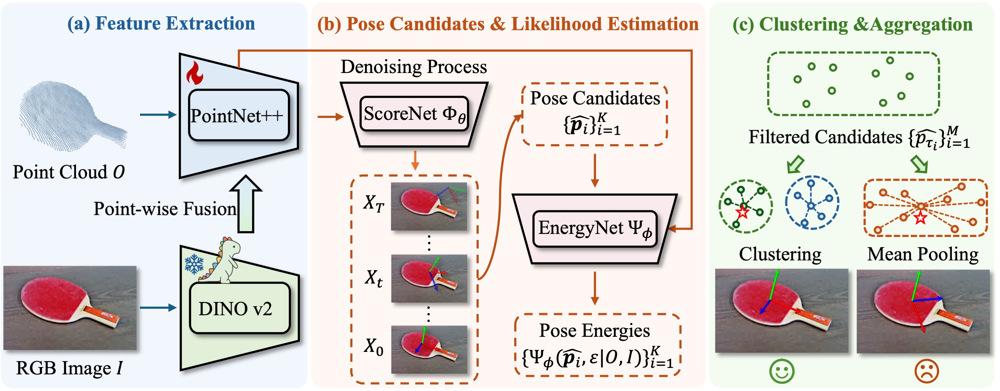

# GenPose++
[](https://jiyao06.github.io/Omni6DPose/)
[](https://arxiv.org/pdf/2406.04316.pdf)
[](https://jiyao06.github.io/Omni6DPose/download/)
[](https://github.com/Omni6DPose/Omni6DPoseAPI/)
[](https://jiyao06.github.io/Omni6DPose/cutoop/)
[](https://github.com/Omni6DPose/GenPose2/blob/main/LICENSE)
[](https://hits.seeyoufarm.com)

The official implementation of GenPose++, as presented in [Omni6DPose](https://jiyao06.github.io/Omni6DPose/). (ECCV 2024)




## ✨ News
* **2024.08.10**: **GenPose++** is released! 🎉
* **2024.08.01**: **<span style="color: #9AEA27;">Omni6DPose</span>** [dataset](https://github.com/Omni6DPose/Omni6DPoseAPI) and [API](https://github.com/Omni6DPose/Omni6DPoseAPI) are released! 🎉
* **2024.07.01**: **<span style="color: #9AEA27;">Omni6DPose</span>** has been accepted by ECCV2024! 🎉


## 📆 TODO
- [x] Release the Omni6DPose dataset. 
- [x] Release the Omni6DPose API.
- [x] Release the GenPose++ and pretrained models.
- [ ] Release a convenient version of GenPose++ with SAM for the downstream tasks.


## ⚙️ Requirements
- Ubuntu 20.04
- Python 3.10.14
- Pytorch 2.1.0
- CUDA 11.8
- 1 * NVIDIA RTX 4090


## 🔨 Installation

- ### Create Environment

```bash
conda create -n genpose2 python==3.10.14
conda activate genpose2
```

- ### Install pytorch

``` bash
conda install cudatoolkit=11
pip install torch==2.1.0 torchvision==0.16.0 torchaudio==2.1.0 --index-url https://download.pytorch.org/whl/cu118
```

- ### Install from requirements.txt

``` bash
pip install -r requirements.txt 
```

- ### Compile pointnet2

``` bash
cd networks/pts_encoder/pointnet2_utils/pointnet2
python setup.py install
```

- ### Compile Cutoop
We provide `cutoop`, a convenient tool for the Omni6DPose dataset. We provide two ways to install it. The detailed installation instructions can be found in the [Omni6DPoseAPI](https://github.com/Omni6DPose/Omni6DPoseAPI/). There we provide the installation instructions using the `pip` package manager.

```bash
sudo apt-get install openexr
pip install cutoop
```

## 🗂️ Download dataset and models

- Download and organize the Omni6DPose dataset by following the instructions provided on the [Omni6DPoseAPI](https://github.com/Omni6DPose/Omni6DPoseAPI) page. Note that the `PAM` dataset and the files `depth_1.zip`, `coord.zip`, and `ir.zip` from the `SOPE` dataset are not required for GenPose++. You may omit downloading these files to save disk space.

- Copy the files from `Meta` to the `$ROOT/configs` directory. The organization of the files should be as follows:

``` bash
genpose2
└──configs
   ├── obj_meta.json
   ├── real_obj_meta.json
   └── config.py
```

- We provide the trained [checkpoints](https://www.dropbox.com/scl/fo/x87lhf7sygjm1gasz153g/AIHBlaGMjhfyW1bKrDe61R4?rlkey=y1f6dqdi40tzcgepccthayudp&st=1sbkxbzf&dl=0). Please download the files to the `$ROOT/results` directory and organize them as follows:

``` bash
genpose2
└──results
   └── ckpts
       ├── ScoreNet
       │   └── scorenet.pth
       ├── EnergyNet
       │   └── energynet.pth
       └── ScaleNet
           └── scalenet.pth
```

## 🚀 Training

Set the parameter `--data_path` in `scripts/train_score.sh`, `scripts/train_energy.sh` and `scripts/train_scale.sh` to your own path of SOPE dataset.

- ### Score network

  Train the score network to generate the pose candidates.

``` bash
bash scripts/train_score.sh
```

- ### Energy network

  Train the energy network to aggragate the pose candidates.

``` bash
bash scripts/train_energy.sh
```

- ### Scale network
  Train the scale network to predict the bounding box length. 
  
  The scale network uses the features extracted by the score network.  You may need to change the parameter `--pretrained_score_model_path` in `scripts/train_scale.sh` if you have trained your own score network.

``` bash
bash scripts/train_scale.sh
```

  

## 🎯 Evaluation

Set the parameter `--data_path` in `scripts/eval_single.sh` to your own path of ROPE dataset.

- ### Evaluate pose estimation performance

``` bash
bash scripts/eval_single.sh
```

- ### Evaluate pose tracking performance

``` bash
bash scripts/eval_tracking.sh
```

## 🔖 Citation

If you find our work useful in your research, please consider citing:

``` bash
@article{zhang2024omni6dpose,
  title={Omni6DPose: A Benchmark and Model for Universal 6D Object Pose Estimation and Tracking},
  author={Zhang, Jiyao and Huang, Weiyao and Peng, Bo and Wu, Mingdong and Hu, Fei and Chen, Zijian and Zhao, Bo and Dong, Hao},
  booktitle={European Conference on Computer Vision},
  year={2024},
  organization={Springer}
}
```

## 📮 Contact

If you have any questions, please feel free to contact us:

[Jiyao Zhang](https://jiyao06.github.io/): [jiyaozhang@stu.pku.edu.cn](mailto:jiyaozhang@stu.pku.edu.cn)

[Weiyao Huang](https://github.com/sshwy): [sshwy@stu.pku.edu.cn](mailto:sshwy@stu.pku.edu.cn)

[Bo Peng](https://github.com/p-b-p-b): [bo.peng@stu.pku.edu.cn](mailto:bo.peng@stu.pku.edu.cn)

[Hao Dong](https://zsdonghao.github.io/): [hao.dong@pku.edu.cn](mailto:hao.dong@pku.edu.cn)

## 📝 License

This project is released under the MIT license. See [LICENSE](LICENSE) for additional details.